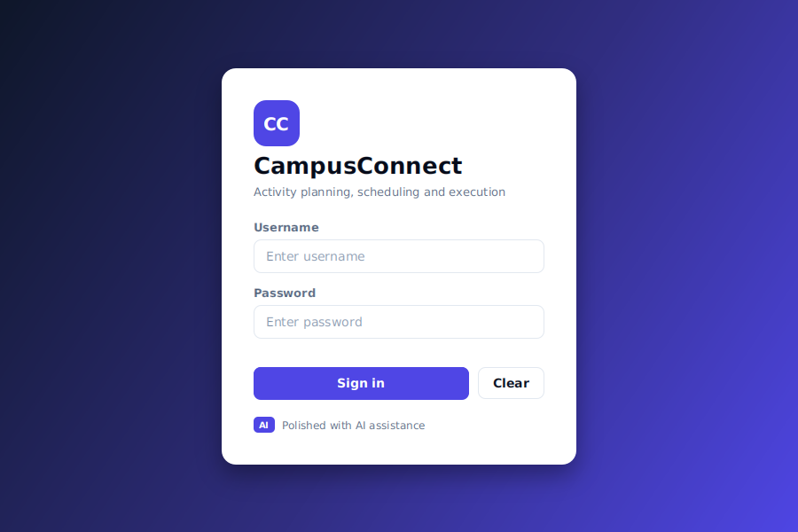
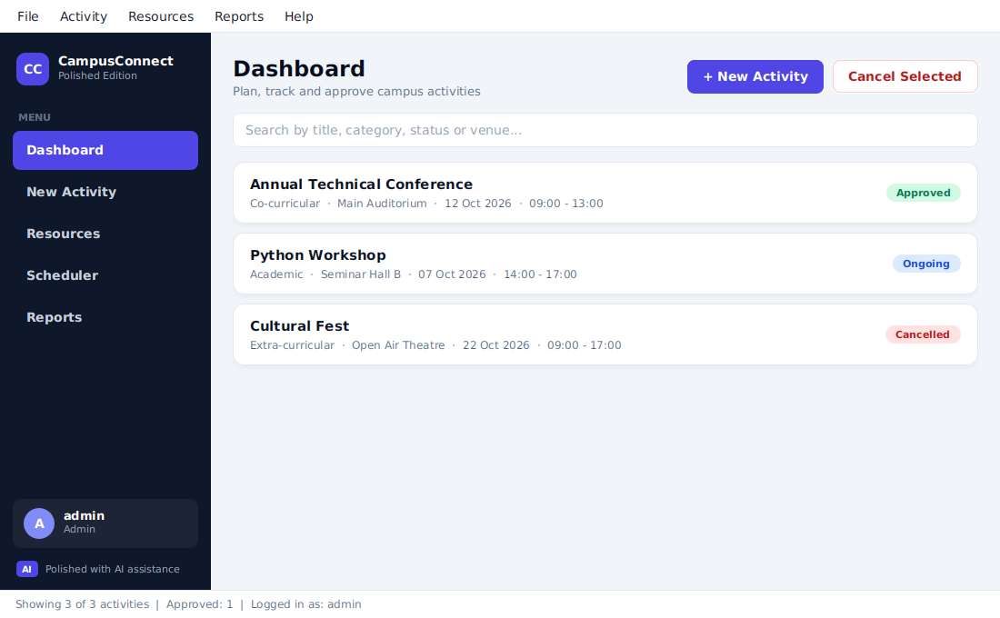
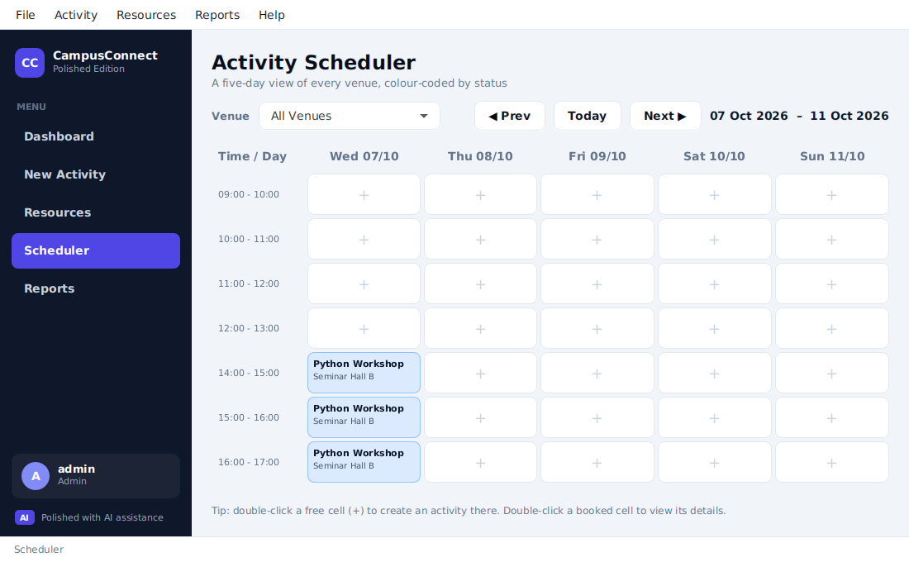
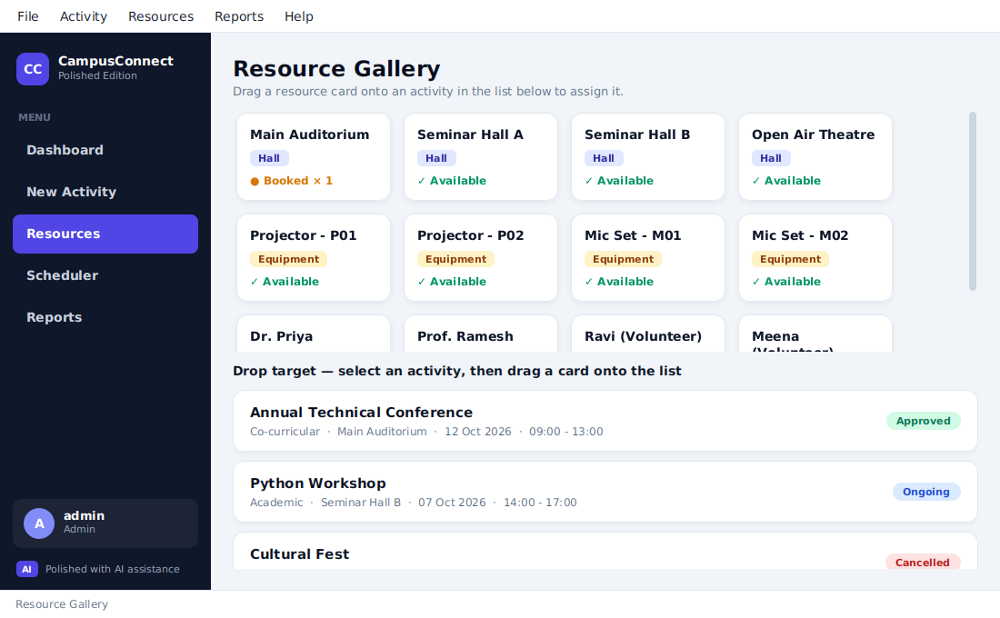

# CampusConnect — Polished Edition

CampusConnect is a JavaFX desktop app for planning, scheduling and running campus activities
(Unit V mini project). This repository has two branches that show two different answers to the
same question: *how good can a Java app look and feel?*

| Branch | What it is |
|---|---|
| `main` | The project as built for the course: a simple, working JavaFX app with default styling. **What we can do with Java.** |
| `polished` | The same app with the interface redesigned using AI and modern tooling. **What we can do with Java if we invest.** |

> **AI disclosure.** The `polished` branch was produced with AI assistance (Claude, by Anthropic).
> The app says so itself: on the login card, in the sidebar, and in *Help → About*.

## What the polished branch changes

The goal was a better interface, not a different app. The model, data store, conflict detection,
status transitions and every screen's behaviour are carried over from `main`.

| Area | Change |
|---|---|
| Styling | One stylesheet, `view/theme.css`, replaces every inline `-fx-` style. Colours are defined once as design tokens. |
| Login | Gradient backdrop and a proper card. |
| Shell | Dark sidebar with active-screen highlight, signed-in user block, flat menu bar and slim status bar. |
| Dashboard | Card-style rows with colour-coded status pills and an empty state. |
| Scheduler | Highlighted "today" column, cells tinted by activity status, columns that fit any window width. |
| Resources | Shadowed cards with hover and drag states, a drop-target highlight, and a modal conflict warning. |
| Forms / detail | Cleaner form layout (scrollable), segmented status control coloured by status. |
| Dialogs | Alerts and dialogs share the same theme. |

Two small non-visual touches: `Navigator` now tells the sidebar which screen is open (for the
highlight), and the *Activity Calendar* report reserves one more character for the category column so
"Extra-curricular" lines up.

## Screenshots

| | |
|---|---|
|  |  |
|  |  |

## Running it

Open the project in IntelliJ IDEA with the JavaFX SDK on the `lib` library (same as `main`) and run
`campusconnect.Main`. The polished branch adds **no new dependencies**: it is plain JavaFX CSS.

Demo logins: `admin / admin123`, `drpriya / pass123`, `volunteer1 / vol123`.

## Project layout

```
src/campusconnect/
  Main.java, Navigator.java
  model/        Activity, Booking, Resource, User
  store/        DataStore (in-memory)
  controller/   one controller per screen
  ui/           Theme (stylesheet + helpers), ActivityCell (dashboard row)
  view/         FXML screens + theme.css
docs/screenshots/
```
